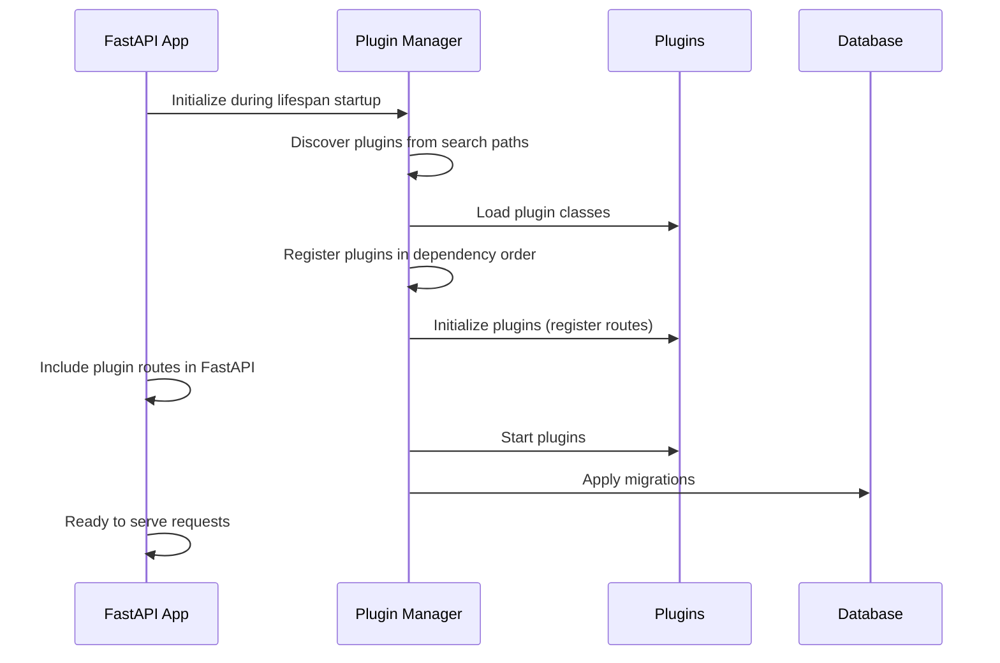

# 🚀 FastAPI Enterprise Plugin System - Complete Guide

## Overview

This guide provides a complete solution for adding new models with full API endpoints that automatically appear in Swagger UI. The system has been completely redesigned to ensure proper plugin discovery, route registration, and documentation integration.

## 🔧 What Was Fixed

### 1. Plugin Discovery and Registration Issues

- **Fixed**: Plugin discovery timing - now happens during app startup lifespan
- **Fixed**: Route registration - plugins are initialized before app serves requests
- **Fixed**: Swagger integration - routes are properly included in OpenAPI schema

### 2. Application Startup Lifecycle

- **Enhanced**: Proper lifespan management with detailed logging
- **Enhanced**: Step-by-step plugin initialization (discover → initialize → startup)
- **Enhanced**: Global plugin manager with proper error handling

### 3. Middleware and CSP Issues

- **Fixed**: Content Security Policy headers to allow Swagger UI CDN resources
- **Fixed**: Middleware order and registration timing
- **Enhanced**: Comprehensive request logging and monitoring

## 🎯 How to Add a New Model - Complete Workflow

### Step 1: Use the Enhanced Plugin Generator

The plugin generator v2.0 provides everything you need:

```bash
# Generate a complete plugin with all features
python scaffold_plugin_generator_v2.py add Product \
    title:str:max_length=200 \
    price:float:gt=0 \
    description:text \
    category:str:indexed \
    sku:str:unique \
    is_active:bool:default=True \
    --with-tasks --with-bulk
```

**What this creates:**

- ✅ SQLAlchemy model with proper table configuration
- ✅ Pydantic schemas with validation
- ✅ Enhanced service layer with repository pattern
- ✅ Complete CRUD FastAPI endpoints
- ✅ Background task integration (optional)
- ✅ Bulk operations support (optional)
- ✅ Automatic database migration
- ✅ Event emission for monitoring

### Step 2: Verify Plugin Creation

```bash
# List all generated plugins
python scaffold_plugin_generator_v2.py list

# Run health check
python scaffold_plugin_generator_v2.py health-check
```

### Step 3: Start the Application

```bash
# Start with auto-reload for development
python -m uvicorn app.main:app --reload

# Or use the demo script for guided setup
python demo_add_plugin.py
```

### Step 4: Verify in Swagger UI

1. **Open Swagger UI**: http://localhost:8000/docs
2. **Check Plugin Status**: http://localhost:8000/plugins/status
3. **Test Endpoints**: All CRUD operations will be automatically available

## 📊 Generated API Endpoints

Each plugin automatically generates the following endpoints:

### Core CRUD Operations

- `GET /products/` - List all products with pagination
- `POST /products/` - Create a new product
- `GET /products/{id}` - Get product by ID
- `PUT /products/{id}` - Update product
- `DELETE /products/{id}` - Delete product
- `GET /products/count/` - Get total count

### Bulk Operations (if enabled)

- `POST /products/bulk/` - Bulk create products
- `PUT /products/bulk/` - Bulk update products

### Background Tasks (if enabled)

- `POST /products/{id}/tasks/{operation}` - Trigger background tasks

## 🏗️ Architecture Deep Dive

### Application Startup Flow



### Plugin Lifecycle States

1. **Discovered** - Plugin file found and loaded
2. **Loaded** - Plugin class instantiated
3. **Initialized** - Routes and middleware registered
4. **Enabled** - Plugin started and operational
5. **Error** - Plugin failed at some stage

## 🔍 Troubleshooting

### Routes Not Appearing in Swagger

**Issue**: Plugin routes don't show up in `/docs`

**Solution**: Check the startup logs for plugin initialization:

```bash
# Look for these log messages:
# 🔌 Initializing enterprise plugin system...
# 📂 Discovered plugins from paths: ['app/plugins']
# 🔧 Plugins initialized and routes registered
# 🟢 Plugins started successfully
```

**Debug Steps**:

1. Check plugin status: `GET /plugins/status`
2. Verify plugin file exists: `app/plugins/your_plugin.py`
3. Check logs for error messages during startup
4. Run health check: `python scaffold_plugin_generator_v2.py health-check`

### Plugin Discovery Issues

**Issue**: Plugins are discovered but not loaded

**Common Causes**:

- Import errors in plugin code
- Missing dependencies
- Invalid plugin class structure

**Debug**:

```bash
# Run the debug script
python debug_product_plugin.py

# Check for syntax errors
python -m py_compile app/plugins/product_plugin.py
```

### Database Migration Issues

**Issue**: Database tables not created

**Solution**:

```bash
# Generate migration manually
alembic revision --autogenerate -m "Add your_model"

# Apply migration
alembic upgrade head
```

## 🚀 Quick Start Demo

Use the provided demo script for a complete walkthrough:

```bash
python demo_add_plugin.py
```

This script will:

1. Generate a sample Product plugin
2. Show the plugin structure
3. Provide testing instructions
4. Optionally start the server

## 📋 Plugin Template Structure

Each generated plugin follows this structure:

```python
class YourModelPlugin(PluginBase):
    @property
    def metadata(self) -> PluginMetadata:
        return PluginMetadata(
            name="your_model_plugin",
            version="1.0.0",
            description="Complete YourModel management",
            # ... metadata
        )

    def setup_routes(self):
        # FastAPI router with all CRUD endpoints
        pass

    async def initialize(self, app, context):
        # Register routes and services
        pass

    async def startup(self):
        # Plugin startup tasks
        pass

    def get_routes(self):
        # Return APIRouter for FastAPI inclusion
        pass
```

## 🔧 Advanced Configuration

### Custom Field Types

Supported field types and constraints:

```bash
# Basic types
name:str:max_length=100
age:int:ge=0:le=120
price:float:gt=0
active:bool:default=True

# Special types
email:email:max_length=255
website:url
id:uuid
metadata:json

# Constraints
unique_field:str:unique
indexed_field:str:indexed
```

### Plugin Dependencies

Plugins can depend on other plugins:

```python
dependencies=["monitoring", "cache"]  # Load after these plugins
priority=20  # Lower number = higher priority
```

## 📈 Production Considerations

### Performance

- Plugin discovery happens once at startup
- Routes are registered efficiently during initialization
- No runtime performance impact

### Monitoring

- Built-in health checks for all plugins
- Event emission for monitoring integration
- Comprehensive logging throughout lifecycle

### Scalability

- Plugin system supports hot-reloading (development)
- Dependency resolution ensures proper loading order
- Event bus enables loose coupling between plugins

## 🎯 Best Practices

1. **Use the plugin generator** - Don't write plugins manually
2. **Test plugin generation** - Use health-check before starting server
3. **Monitor startup logs** - Check for initialization errors
4. **Verify in Swagger** - Always test endpoints in `/docs`
5. **Use proper field types** - Leverage validation and constraints
6. **Enable features selectively** - Only use `--with-tasks` if needed

## 🔗 Related Files

- `app/main.py` - Main application with plugin integration
- `scaffold_plugin_generator_v2.py` - Plugin generator tool
- `demo_add_plugin.py` - Complete demo workflow
- `app/core/plugin_system.py` - Plugin system implementation
- `app/core/middleware.py` - CSP fixes for Swagger

---

**Success Criteria**: After following this guide, you should see your plugin routes in Swagger UI at `/docs` and be able to perform CRUD operations on your new model.

For issues or questions, check the startup logs and use the provided debugging tools.
