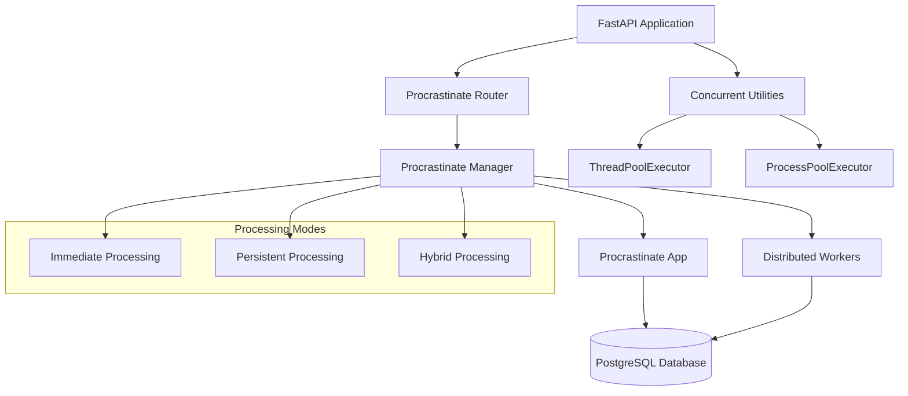

# Procrastinate Integration - PostgreSQL Task Queue Implementation

## Overview

This document describes the integration of **Procrastinate**, a PostgreSQL-based task queue, into the FastAPI PostgreSQL boilerplate. Procrastinate provides persistent, distributed task processing that complements the existing concurrent.futures implementation, offering the best of both worlds for different use cases.

## What is Procrastinate?

Procrastinate is a PostgreSQL-based task queue for Python that:

- Uses PostgreSQL 13+ to store task definitions and manage locks
- Provides distributed task processing across multiple workers
- Supports both synchronous and asynchronous code
- Offers built-in retry mechanisms and task scheduling
- Leverages PostgreSQL's advanced features for reliability and performance

### Benefits Over Celery + Redis/RabbitMQ

1. **Simplified Stack**: Uses your existing PostgreSQL database - no additional brokers required
2. **ACID Compliance**: Tasks are stored with full ACID guarantees
3. **Distributed Locks**: Built-in PostgreSQL-based locking mechanisms
4. **Persistence**: Tasks survive system restarts and failures
5. **Monitoring**: Query tasks directly from your database
6. **Integration**: Seamless integration with existing PostgreSQL-based applications

## Architecture

The implementation provides a hybrid approach combining:



## Implementation Components

### 1. Core Components

#### Procrastinate Manager (`app/utils/procrastinate_manager.py`)

- **ProcrastinateManager**: High-level interface for task management
- **Task Definitions**: Pre-defined tasks for different operations
- **Queue Configuration**: Separate queues for different task types
- **Priority Management**: Task priority system integration

#### Enhanced Service (`app/services/enhanced_procrastinate_service.py`)

- **EnhancedProcrastinateService**: Combines concurrent.futures with Procrastinate
- **ProcessingMode**: Configurable processing strategies
- **Hybrid Processing**: Automatic fallback between immediate and persistent processing
- **Error Handling**: Comprehensive error handling and retry logic

#### API Endpoints (`app/api/v1/endpoints/procrastinate_tasks.py`)

- **Task Management**: Create, schedule, and monitor tasks
- **Bulk Operations**: Handle large-scale operations
- **Status Monitoring**: Job status and queue health endpoints
- **Scheduling**: Future task scheduling capabilities

### 2. Task Types and Queues

The implementation defines seven specialized queues:

| Queue             | Purpose                    | Concurrency | Retry |
| ----------------- | -------------------------- | ----------- | ----- |
| `user_processing` | User data operations       | High        | 3     |
| `data_processing` | Bulk data processing       | High        | 3     |
| `notifications`   | Message delivery           | Medium      | 2     |
| `file_processing` | File operations            | Medium      | 2     |
| `analytics`       | Report generation (locked) | Low         | 2     |
| `maintenance`     | Cleanup operations         | Low         | 1     |
| `health_checks`   | System monitoring          | Low         | 1     |

### 3. Processing Modes

#### Immediate Processing

- Uses concurrent.futures for fast, in-memory processing
- Best for: Small datasets, real-time operations
- Execution: ThreadPoolExecutor/ProcessPoolExecutor

#### Persistent Processing

- Uses Procrastinate for durable, distributed processing
- Best for: Large datasets, long-running operations, reliability-critical tasks
- Execution: Distributed workers across multiple machines

#### Hybrid Processing

- Automatically chooses between immediate and persistent based on thresholds
- Provides fallback mechanisms for fault tolerance
- Configurable thresholds and strategies

## Configuration

### Environment Variables

Add to your `.env` file:

```bash
# Procrastinate Configuration
PROCRASTINATE_SCHEMA=procrastinate
PROCRASTINATE_APP_NAME=FastAPI App
PROCRASTINATE_WORKER_CONCURRENCY=10
PROCRASTINATE_LOG_LEVEL=INFO

# PostgreSQL Connection (for Procrastinate sync connection)
POSTGRES_HOST=localhost
POSTGRES_PORT=5432
POSTGRES_USER=postgres
POSTGRES_PASSWORD=password
POSTGRES_DATABASE=fastapi_db
```

### Dependencies

Added to `pyproject.toml`:

```toml
[project]
dependencies = [
    # ... existing dependencies
    "procrastinate>=3.0.0",
]
```

## Usage Examples

### 1. Basic Task Creation

```python
from app.utils.procrastinate_manager import get_procrastinate_manager

# User processing task
manager = await get_procrastinate_manager()
job_id = await manager.defer_user_processing(
    user_id=123,
    operation="update_profile",
    priority=ProcrastinateTaskPriority.HIGH
)
```

### 2. Bulk Data Processing with Hybrid Mode

```python
from app.services.enhanced_procrastinate_service import EnhancedProcrastinateService, ProcessingMode

service = EnhancedProcrastinateService(MyModel)

# Hybrid processing - automatically chooses best method
result = await service.process_bulk_data_hybrid(
    db=db_session,
    data_items=large_dataset,
    processing_func=my_processing_function,
    mode=ProcessingMode.HYBRID,
    immediate_threshold=100  # Use immediate processing for <100 items
)
```

### 3. Reliable Notifications

```python
notifications = [
    {
        "type": "email",
        "recipient": "user@example.com",
        "message": "Welcome to our platform!",
        "metadata": {"template": "welcome"}
    }
]

result = await service.send_notifications_reliable(
    notifications=notifications,
    priority=ProcrastinateTaskPriority.HIGH,
    retry_failed=True
)
```

### 4. Scheduled Tasks

```python
from datetime import datetime, timedelta

# Schedule cleanup for tomorrow
cleanup_time = datetime.now() + timedelta(days=1)
result = await service.schedule_maintenance_tasks(
    tasks=[{"type": "cleanup", "days_old": 30}],
    schedule_time=cleanup_time
)
```

## API Endpoints

### Core Task Operations

```bash
# Create user processing task
curl -X POST http://localhost:8000/api/v1/procrastinate/user-processing \
  -H "Content-Type: application/json" \
  -d '{
    "user_id": 123,
    "operation": "update_profile",
    "priority": "high",
    "additional_data": {"field": "value"}
  }'

# Bulk data processing
curl -X POST http://localhost:8000/api/v1/procrastinate/bulk-processing \
  -H "Content-Type: application/json" \
  -d '{
    "data_items": [{"id": 1}, {"id": 2}],
    "task_type": "parallel",
    "priority": "normal"
  }'

# Send notification
curl -X POST http://localhost:8000/api/v1/procrastinate/notifications \
  -H "Content-Type: application/json" \
  -d '{
    "notification_type": "email",
    "recipient": "user@example.com",
    "message": "Hello World!",
    "priority": "high"
  }'
```

### File Processing

```bash
# Process file
curl -X POST http://localhost:8000/api/v1/procrastinate/file-processing \
  -H "Content-Type: application/json" \
  -d '{
    "file_path": "/path/to/file.csv",
    "operation": "analyze",
    "priority": "normal",
    "file_size": 1048576
  }'
```

### Analytics and Reports

```bash
# Generate analytics report (locked execution)
curl -X POST http://localhost:8000/api/v1/procrastinate/analytics-reports \
  -H "Content-Type: application/json" \
  -d '{
    "report_type": "user_activity",
    "date_range": {
      "start": "2024-01-01",
      "end": "2024-01-31"
    },
    "priority": "high"
  }'
```

### Scheduling

```bash
# Schedule cleanup task
curl -X POST http://localhost:8000/api/v1/procrastinate/scheduled/cleanup \
  -H "Content-Type: application/json" \
  -d '{
    "task_type": "cleanup",
    "parameters": {"days_old": 30},
    "schedule_at": "2024-12-25T02:00:00"
  }'

# Schedule health check
curl -X POST http://localhost:8000/api/v1/procrastinate/scheduled/health-check \
  -H "Content-Type: application/json" \
  -d '{
    "task_type": "health_check",
    "schedule_at": "2024-12-25T03:00:00"
  }'
```

### Monitoring

```bash
# Get job status
curl http://localhost:8000/api/v1/procrastinate/jobs/{job_id}/status

# Get queue statistics
curl http://localhost:8000/api/v1/procrastinate/queue/stats

# Health check
curl http://localhost:8000/api/v1/procrastinate/health
```

## Worker Management

### Standalone Worker CLI

The `procrastinate_worker.py` script provides comprehensive worker management:

```bash
# Run worker for all queues
python procrastinate_worker.py worker

# Run worker for specific queues
python procrastinate_worker.py worker --queues user_processing data_processing --concurrency 20

# Apply database schema
python procrastinate_worker.py schema

# Health checks
python procrastinate_worker.py healthchecks

# Interactive shell
python procrastinate_worker.py shell
```

### Docker Deployment

Use `docker-compose.procrastinate.yml` for distributed deployment:

```bash
# Start all services including workers
docker-compose -f docker-compose.procrastinate.yml up

# Scale workers
docker-compose -f docker-compose.procrastinate.yml up --scale procrastinate_worker_general=3

# Check worker logs
docker-compose -f docker-compose.procrastinate.yml logs procrastinate_worker_general
```

The Docker setup includes:

- **Main App**: FastAPI application with Procrastinate integration
- **General Worker**: Handles user processing, data processing, notifications
- **File Worker**: Specialized for file operations
- **Analytics Worker**: Handles analytics reports with limited concurrency
- **Maintenance Worker**: Cleanup and health check operations

## Performance Characteristics

### Throughput Comparisons

| Operation       | Mode       | Items | Time     | Throughput         |
| --------------- | ---------- | ----- | -------- | ------------------ |
| User Creation   | Immediate  | 1,000 | 3-5s     | 200-333/s          |
| User Creation   | Persistent | 1,000 | Variable | Depends on workers |
| File Processing | Immediate  | 100   | 8-12s    | 8-12/s             |
| File Processing | Persistent | 100   | Variable | Depends on workers |
| Notifications   | Persistent | 500   | Variable | High reliability   |

### Memory Usage

- **Immediate Processing**: Higher memory usage, faster execution
- **Persistent Processing**: Lower memory usage, distributed execution
- **Hybrid Mode**: Balanced resource usage with intelligent switching

## Database Schema

Procrastinate automatically creates these tables:

```sql
-- Main job storage
procrastinate_jobs
- id (bigint, primary key)
- task_name (varchar)
- queue_name (varchar)
- priority (int)
- args (jsonb)
- status (varchar)
- scheduled_at (timestamp)
- started_at (timestamp)
- finished_at (timestamp)
- attempts (int)

-- Event log
procrastinate_events
- id (bigint, primary key)
- job_id (bigint)
- type (varchar)
- at (timestamp)

-- Periodic tasks
procrastinate_periodic_defers
-- (for future periodic task implementation)
```

## Monitoring and Observability

### Health Checks

```python
# Comprehensive health check
health_info = await service.get_queue_health()
# Returns status for all processing systems:
# - Procrastinate workers
# - Enhanced task queue
# - Concurrent processing utilities
```

### Metrics Collection

Monitor these key metrics:

1. **Job Metrics**:

   - Queue depth by queue name
   - Job completion rates
   - Failed job counts
   - Average processing time

2. **Worker Metrics**:

   - Active workers per queue
   - Worker utilization
   - Worker health status

3. **Performance Metrics**:
   - Throughput by operation type
   - Memory usage patterns
   - Database connection health

### Custom Monitoring Implementation

For production monitoring, implement custom queries:

```sql
-- Active jobs by queue
SELECT queue_name, COUNT(*) as active_jobs
FROM procrastinate_jobs
WHERE status = 'todo'
GROUP BY queue_name;

-- Failed jobs in last hour
SELECT COUNT(*) as failed_jobs
FROM procrastinate_jobs
WHERE status = 'failed'
  AND finished_at > NOW() - INTERVAL '1 hour';

-- Average processing time by task
SELECT task_name, AVG(EXTRACT(EPOCH FROM (finished_at - started_at))) as avg_seconds
FROM procrastinate_jobs
WHERE status = 'succeeded'
  AND finished_at > NOW() - INTERVAL '24 hours'
GROUP BY task_name;
```

## Best Practices

### 1. Task Design

- **Idempotent Tasks**: Design tasks to be safely retryable
- **Small Payloads**: Keep task arguments small for better performance
- **Timeout Handling**: Implement appropriate timeouts for long-running tasks
- **Error Handling**: Use proper exception handling with meaningful error messages

### 2. Queue Management

- **Queue Separation**: Use different queues for different types of operations
- **Priority Management**: Use priorities to ensure critical tasks are processed first
- **Worker Scaling**: Scale workers based on queue depth and processing requirements
- **Dead Letter Handling**: Implement handling for permanently failed tasks

### 3. Production Deployment

- **Worker Distribution**: Deploy workers across multiple machines for reliability
- **Database Connections**: Monitor and limit database connections per worker
- **Logging**: Implement comprehensive logging for debugging and monitoring
- **Backup Strategy**: Include Procrastinate tables in your backup strategy

### 4. Development Workflow

- **Local Testing**: Use the CLI worker for local development
- **Integration Tests**: Test both immediate and persistent processing paths
- **Load Testing**: Test with realistic data volumes and concurrency
- **Migration Strategy**: Plan for schema updates and worker deployments

## Troubleshooting

### Common Issues

1. **Worker Not Processing Jobs**:

   ```bash
   # Check worker status
   python procrastinate_worker.py healthchecks

   # Check database connectivity
   python procrastinate_worker.py shell
   ```

2. **High Memory Usage**:

   - Reduce worker concurrency
   - Switch to persistent processing for large datasets
   - Monitor and tune batch sizes

3. **Database Connection Issues**:

   - Check PostgreSQL connection limits
   - Verify network connectivity between workers and database
   - Review connection pooling configuration

4. **Task Failures**:
   - Check worker logs for error details
   - Verify task argument serialization
   - Review database table constraints

### Debugging Commands

```bash
# View active jobs
SELECT * FROM procrastinate_jobs WHERE status = 'doing';

# View recent failures
SELECT * FROM procrastinate_jobs WHERE status = 'failed' ORDER BY finished_at DESC LIMIT 10;

# Clear failed jobs (development only)
DELETE FROM procrastinate_jobs WHERE status = 'failed';

# View worker activity
SELECT * FROM procrastinate_events WHERE type = 'job_started' ORDER BY at DESC LIMIT 20;
```

## Integration with Existing Systems

### Concurrent Processing Integration

The implementation seamlessly integrates with the existing concurrent.futures system:

```python
# Existing concurrent processing still works
results = await execute_parallel(items, process_func, TaskType.IO_BOUND)

# New hybrid processing provides automatic optimization
results = await service.process_bulk_data_hybrid(
    db, items, process_func, ProcessingMode.HYBRID
)
```

### Enhanced Base Service Integration

All existing enhanced base service methods remain available:

```python
class MyService(EnhancedProcrastinateService):
    def __init__(self):
        super().__init__(MyModel)

    async def my_custom_operation(self, db: AsyncSession):
        # Use existing enhanced methods
        await self.bulk_create_parallel(db, items)

        # Or use new Procrastinate features
        await self.process_bulk_data_hybrid(db, items, my_func)
```

## Future Enhancements

### Planned Features

1. **Periodic Tasks**: Cron-like scheduling for recurring operations
2. **Task Chaining**: Complex workflows with task dependencies
3. **Advanced Monitoring**: Prometheus metrics integration
4. **Auto-scaling**: Dynamic worker scaling based on queue depth
5. **Task Priorities**: More granular priority management
6. **Dead Letter Queues**: Handling for permanently failed tasks

### Custom Extensions

The architecture supports easy extension for custom task types:

```python
@procrastinate_app.task(queue="custom_queue", retry=3)
async def my_custom_task(data: Dict[str, Any]) -> Dict[str, Any]:
    # Custom task implementation
    return {"result": "success"}

# Usage
job_id = await my_custom_task.defer_async(data={"key": "value"})
```

## Conclusion

The Procrastinate integration provides a robust, scalable task processing system that:

- **Simplifies Infrastructure**: Uses existing PostgreSQL database
- **Improves Reliability**: Persistent task storage with retries
- **Enables Distribution**: Scale workers across multiple machines
- **Maintains Performance**: Hybrid processing for optimal performance
- **Supports Growth**: Scales from development to enterprise deployment

This implementation transforms the FastAPI PostgreSQL boilerplate into an enterprise-ready platform capable of handling complex, large-scale operations while maintaining the simplicity and reliability of PostgreSQL-based infrastructure.
