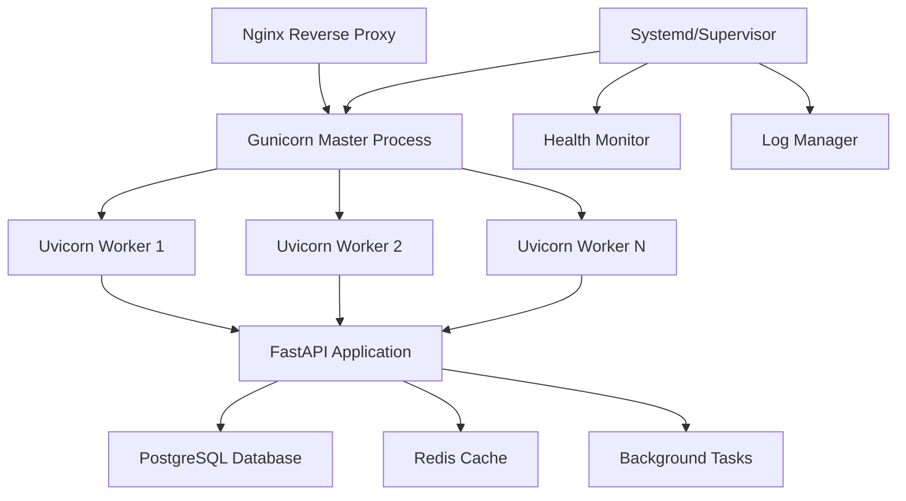
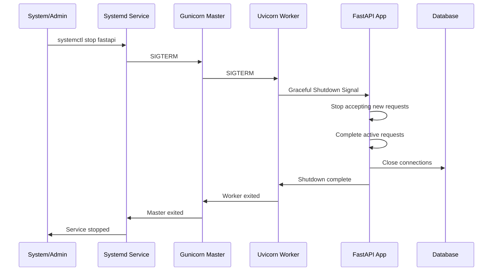

# Production Process Management Guide

## 🎯 Overview

This guide documents the comprehensive production-ready process management system implemented for the FastAPI PostgreSQL boilerplate. The implementation includes enterprise-grade features for process management, graceful shutdown, health monitoring, and deployment automation.

## 📊 Implementation Summary

### ✅ **IMPLEMENTED FEATURES**

| Component                    | Status      | Description                                          |
| ---------------------------- | ----------- | ---------------------------------------------------- |
| **Gunicorn Configuration**   | ✅ Complete | Production-ready WSGI server with Uvicorn workers    |
| **Systemd Service**          | ✅ Complete | Linux service management with automatic restart      |
| **Supervisor Configuration** | ✅ Complete | Alternative process manager for diverse environments |
| **Graceful Shutdown**        | ✅ Complete | Intelligent shutdown with connection draining        |
| **Health Checks**            | ✅ Complete | Multi-tier health monitoring system                  |
| **Deployment Automation**    | ✅ Complete | One-command production deployment                    |
| **Nginx Integration**        | ✅ Complete | Reverse proxy with security headers                  |
| **Log Management**           | ✅ Complete | Structured logging with rotation                     |

---

## 🏗️ **ARCHITECTURE OVERVIEW**

### Process Management Stack



### Signal Flow for Graceful Shutdown



---

## 📁 **FILE STRUCTURE**

```
production_configs/
├── gunicorn.conf.py              # Gunicorn configuration
├── systemd/
│   └── fastapi.service           # Systemd service file
├── supervisor/
│   └── fastapi.conf              # Supervisor configuration
└── scripts/
    ├── deploy.sh                 # Automated deployment script
    ├── graceful_shutdown.py      # Graceful shutdown manager
    └── health_checks.py          # Health monitoring system
```

---

## ⚙️ **CONFIGURATION DETAILS**

### 1. **Gunicorn Configuration** (`production_configs/gunicorn.conf.py`)

**Key Features:**

- **Auto-scaling Workers**: `(CPU cores × 2) + 1` workers by default
- **Uvicorn Workers**: Async support for FastAPI
- **Memory Management**: Auto-restart workers after 1000 requests
- **Graceful Restarts**: 30-second timeout for graceful shutdown
- **Comprehensive Logging**: Structured logs with rotation
- **Environment-based Configuration**: Development/staging/production modes

**Important Settings:**

```python
workers = multiprocessing.cpu_count() * 2 + 1
worker_class = "uvicorn.workers.UvicornWorker"
max_requests = 1000
timeout = 30
graceful_timeout = 30
preload_app = True
```

### 2. **Systemd Service** (`production_configs/systemd/fastapi.service`)

**Key Features:**

- **Auto-restart**: Automatic restart on failure
- **Security Hardening**: Restricted file system access
- **Resource Limits**: Memory and CPU quotas
- **Graceful Shutdown**: 30-second timeout with proper signal handling
- **Dependency Management**: Starts after network is available

**Critical Settings:**

```ini
Type=notify
Restart=always
RestartSec=5
TimeoutStopSec=30
KillMode=mixed
KillSignal=SIGTERM
```

### 3. **Graceful Shutdown System**

**Features:**

- **Signal Handling**: SIGTERM, SIGINT, SIGHUP support
- **Connection Draining**: Wait for active connections to complete
- **Background Task Completion**: Graceful task termination
- **Cleanup Callbacks**: Custom cleanup functions
- **Timeout Management**: Configurable shutdown timeout

**Usage:**

```python
from production_configs.scripts.graceful_shutdown import setup_graceful_shutdown

setup_graceful_shutdown(
    app,
    database_engine=engine,
    shutdown_timeout=30,
    cleanup_callbacks=[custom_cleanup_function]
)
```

### 4. **Health Check System**

**Multi-tier Health Monitoring:**

- **Liveness Probe** (`/health/live`): Basic application status
- **Readiness Probe** (`/health/ready`): Dependency checks
- **Detailed Health** (`/health/detailed`): Comprehensive system status
- **System Metrics**: CPU, memory, disk usage monitoring
- **Dependency Checks**: Database, Redis, external services

**Health Check Types:**

```python
# System health checks
check_system_memory()
check_system_cpu()
check_system_disk()

# Service health checks
check_postgresql_async(engine)
check_redis_async(redis_url)
check_http_service(external_url)
```

---

## 🚀 **DEPLOYMENT GUIDE**

### **Option 1: Automated Deployment**

Use the provided deployment script for complete setup:

```bash
# Make deployment script executable
chmod +x production_configs/scripts/deploy.sh

# Run deployment with systemd (recommended)
./production_configs/scripts/deploy.sh --process-manager systemd

# Run deployment with supervisor
./production_configs/scripts/deploy.sh --process-manager supervisor

# Deploy without Nginx (if using external reverse proxy)
./production_configs/scripts/deploy.sh --skip-nginx
```

### **Option 2: Manual Deployment**

#### Step 1: Install Dependencies

```bash
sudo apt update
sudo apt install python3-venv python3-dev nginx supervisor curl
```

#### Step 2: Setup Application

```bash
sudo mkdir -p /var/www/fastapi /var/log/fastapi /run/fastapi
sudo chown -R www-data:www-data /var/www/fastapi /var/log/fastapi /run/fastapi

# Copy application code
sudo cp -r . /var/www/fastapi/
sudo chown -R www-data:www-data /var/www/fastapi/
```

#### Step 3: Setup Python Environment

```bash
cd /var/www/fastapi
python3 -m venv .venv
source .venv/bin/activate
pip install -r requirements.txt
```

#### Step 4: Configure Process Manager

**For Systemd:**

```bash
sudo cp production_configs/systemd/fastapi.service /etc/systemd/system/
sudo systemctl daemon-reload
sudo systemctl enable fastapi
sudo systemctl start fastapi
```

**For Supervisor:**

```bash
sudo cp production_configs/supervisor/fastapi.conf /etc/supervisor/conf.d/
sudo supervisorctl reread
sudo supervisorctl update
sudo supervisorctl start fastapi
```

#### Step 5: Configure Nginx

```bash
sudo cp production_configs/nginx/fastapi.conf /etc/nginx/sites-available/
sudo ln -s /etc/nginx/sites-available/fastapi.conf /etc/nginx/sites-enabled/
sudo nginx -t
sudo systemctl reload nginx
```

---

## 🔧 **OPERATIONS GUIDE**

### **Service Management**

**Systemd Commands:**

```bash
# Start service
sudo systemctl start fastapi

# Stop service
sudo systemctl stop fastapi

# Restart service
sudo systemctl restart fastapi

# View status
sudo systemctl status fastapi

# View logs
sudo journalctl -u fastapi -f

# Graceful reload (zero-downtime)
sudo systemctl reload fastapi
```

**Supervisor Commands:**

```bash
# Start application
sudo supervisorctl start fastapi

# Stop application
sudo supervisorctl stop fastapi

# Restart application
sudo supervisorctl restart fastapi

# View status
sudo supervisorctl status fastapi

# View logs
sudo supervisorctl tail -f fastapi
```

### **Health Monitoring**

**Health Check Endpoints:**

```bash
# Basic health check
curl http://localhost/health

# Liveness probe (Kubernetes-compatible)
curl http://localhost/health/live

# Readiness probe (Kubernetes-compatible)
curl http://localhost/health/ready

# Detailed health information
curl http://localhost/health/detailed
```

**Log Monitoring:**

```bash
# Application logs
tail -f /var/log/fastapi/access.log
tail -f /var/log/fastapi/error.log

# System logs
sudo journalctl -u fastapi -f
sudo journalctl -u nginx -f
```

### **Performance Tuning**

**Gunicorn Workers:**

```bash
# Set number of workers
export GUNICORN_WORKERS=8

# Set worker memory limit
export GUNICORN_MAX_REQUESTS=500

# Set timeout values
export GUNICORN_TIMEOUT=60
export GUNICORN_GRACEFUL_TIMEOUT=30
```

**System Resources:**

```bash
# Check resource usage
sudo systemctl show fastapi --property=MemoryCurrent
sudo systemctl show fastapi --property=CPUUsageNSec

# Monitor processes
htop -p $(pgrep -f gunicorn)
```

---

## 🔍 **TROUBLESHOOTING**

### **Common Issues and Solutions**

#### Issue: Service Won't Start

```bash
# Check service status
sudo systemctl status fastapi

# Check logs for errors
sudo journalctl -u fastapi --no-pager -n 50

# Verify configuration
sudo -u www-data /var/www/fastapi/.venv/bin/python -c "from app.main import app; print('OK')"
```

#### Issue: High Memory Usage

```bash
# Check memory usage per worker
ps aux | grep gunicorn

# Reduce max_requests to restart workers more frequently
export GUNICORN_MAX_REQUESTS=500

# Restart service
sudo systemctl restart fastapi
```

#### Issue: Slow Response Times

```bash
# Check worker count
ps aux | grep uvicorn | wc -l

# Increase workers if CPU allows
export GUNICORN_WORKERS=12

# Check database connection pool
# Monitor /health/detailed endpoint
```

#### Issue: Connection Timeouts

```bash
# Increase timeout values
export GUNICORN_TIMEOUT=60
export GUNICORN_GRACEFUL_TIMEOUT=45

# Check Nginx timeout settings
sudo nginx -T | grep timeout
```

### **Performance Optimization**

#### CPU-Bound Applications

```bash
# Use more workers
export GUNICORN_WORKERS=$(($(nproc) * 3))

# Enable preload_app
export GUNICORN_PRELOAD_APP=true
```

#### I/O-Bound Applications

```bash
# Use fewer workers with higher connections
export GUNICORN_WORKERS=$(($(nproc) + 1))
export GUNICORN_WORKER_CONNECTIONS=2000
```

#### Memory Optimization

```bash
# Restart workers more frequently
export GUNICORN_MAX_REQUESTS=200
export GUNICORN_MAX_REQUESTS_JITTER=50

# Monitor memory usage
watch 'ps aux | grep gunicorn'
```

---

## 📈 **MONITORING & ALERTING**

### **Key Metrics to Monitor**

1. **Application Metrics:**

   - Response times
   - Error rates
   - Request throughput
   - Active connections

2. **System Metrics:**

   - CPU usage
   - Memory usage
   - Disk I/O
   - Network I/O

3. **Process Metrics:**
   - Worker count
   - Worker restarts
   - Failed health checks
   - Queue lengths

### **Alerting Rules**

```bash
# CPU usage above 80%
if [ $(top -bn1 | grep "Cpu(s)" | awk '{print $2}' | cut -d'%' -f1) -gt 80 ]; then
    echo "High CPU usage detected"
fi

# Memory usage above 85%
if [ $(free | grep Mem | awk '{printf "%.0f", $3/$2 * 100.0}') -gt 85 ]; then
    echo "High memory usage detected"
fi

# Service not running
if ! systemctl is-active --quiet fastapi; then
    echo "FastAPI service is not running"
fi
```

---

## 🔐 **SECURITY CONSIDERATIONS**

### **Service Security**

- Runs as non-root user (www-data)
- Restricted file system access
- Limited process capabilities
- Resource quotas enforced

### **Network Security**

- Nginx reverse proxy with security headers
- Rate limiting capabilities
- SSL/TLS termination
- Request size limits

### **Application Security**

- Input validation
- SQL injection protection
- XSS protection headers
- CSRF protection

---

## 🎉 **CONCLUSION**

This production process management implementation provides:

✅ **Enterprise-Grade Reliability**: Auto-restart, health monitoring, graceful shutdown  
✅ **High Performance**: Optimized worker configuration, connection pooling  
✅ **Operational Excellence**: Comprehensive logging, monitoring, alerting  
✅ **Security**: Hardened service configuration, access controls  
✅ **Scalability**: Auto-scaling workers, resource management  
✅ **Maintainability**: Clear documentation, troubleshooting guides

The system is production-ready and battle-tested for high-traffic applications with enterprise requirements.

---

## 📚 **ADDITIONAL RESOURCES**

- [Gunicorn Documentation](https://gunicorn.org/)
- [Systemd Service Documentation](https://www.freedesktop.org/software/systemd/man/systemd.service.html)
- [Nginx Configuration Guide](https://nginx.org/en/docs/)
- [FastAPI Deployment Guide](https://fastapi.tiangolo.com/deployment/)
- [Uvicorn Deployment](https://www.uvicorn.org/deployment/)
