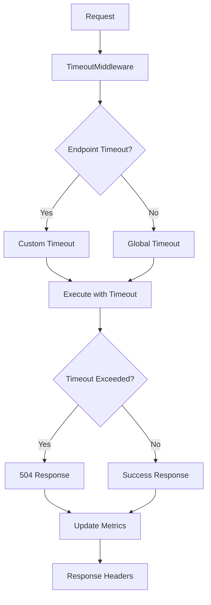

# Timeout System Configuration Guide

## Overview

The enhanced timeout system provides comprehensive request timeout management with multiple layers of protection:

- **Middleware-level timeouts**: Global request timeouts with metrics and monitoring
- **Decorator-based timeouts**: Custom timeouts for specific functions
- **Context-based timeouts**: Database and operation-specific timeouts
- **Endpoint-specific timeouts**: Different timeout limits per API endpoint

## Architecture



## Configuration

### 1. Global Timeout Settings

Configure in `app/main.py`:

```python
# Global timeout configuration (in seconds)
GLOBAL_REQUEST_TIMEOUT = 30.0

# Add timeout middleware with enhanced features
app.add_middleware(
    TimeoutMiddleware,
    timeout_seconds=GLOBAL_REQUEST_TIMEOUT,
    warning_threshold=0.8,  # Warn at 80% of timeout
    enable_metrics=True
)
```

### 2. Endpoint-Specific Timeouts

Configure in `app/middleware/timeout_middleware.py`:

```python
# Define endpoint-specific timeouts
endpoint_timeouts = {
    "/api/v1/auth/": 10.0,  # Auth endpoints - shorter timeout
    "/api/v1/users/": 15.0,  # User operations
    "/api/v1/data/": 60.0,   # Data processing - longer timeout
    "/health": 5.0,          # Health checks - very short
    "/metrics": 5.0,         # Metrics - very short
}
```

### 3. Environment Variables

Set these environment variables for production:

```bash
# Timeout Configuration
GLOBAL_REQUEST_TIMEOUT=30
TIMEOUT_WARNING_THRESHOLD=0.8
ENABLE_TIMEOUT_METRICS=true

# Database Timeouts
DATABASE_TIMEOUT=10
EXTERNAL_API_TIMEOUT=15
HEAVY_COMPUTATION_TIMEOUT=60
```

## Usage Examples

### 1. Using Timeout Decorators

```python
from app.core.timeouts import with_timeout, TimeoutException

@with_timeout(timeout_seconds=10.0)
async def my_function():
    # Your code here
    await some_operation()
    return result

# Usage
try:
    result = await my_function()
except TimeoutException:
    # Handle timeout
    pass
```

### 2. Using Timeout Context Managers

```python
from app.core.timeouts import database_timeout_context

async def database_operation():
    try:
        async with database_timeout_context(10.0):
            # Database operations
            result = await db.execute(query)
            return result
    except TimeoutException:
        # Handle database timeout
        raise HTTPException(504, "Database operation timed out")
```

### 3. Route-Specific Timeouts

```python
from fastapi import APIRouter

router = APIRouter()

@router.get("/slow-endpoint")
@with_timeout(timeout_seconds=60.0)  # Custom timeout for this endpoint
async def slow_endpoint():
    # Long-running operation
    await heavy_computation()
    return {"status": "completed"}
```

## Monitoring and Metrics

### 1. Accessing Timeout Metrics

```python
# Get metrics from middleware
timeout_middleware = app.middleware_stack[0]  # Adjust index
metrics = timeout_middleware.get_metrics()

print(f"Total requests: {metrics['total_requests']}")
print(f"Timeout count: {metrics['timeout_count']}")
print(f"Timeout rate: {metrics['timeout_rate']:.2%}")
```

### 2. Metrics Endpoints

- **Timeout Metrics**: `GET /api/v1/test/timeout/metrics`
- **System Health**: `GET /api/v1/test/timeout/health`

### 3. Response Headers

All responses include timeout information:

```
X-Request-Duration: 2.345
X-Timeout-Limit: 30
```

Timeout responses include additional headers:

```
X-Request-Duration: 30.001
X-Timeout-Limit: 30
Retry-After: 60
```

## Testing

### 1. Manual Testing

```bash
# Quick operation (should succeed)
curl "http://localhost:8000/api/v1/test/timeout/quick?delay=1.0"

# Slow operation (should timeout)
curl "http://localhost:8000/api/v1/test/timeout/slow?delay=35.0"

# Database timeout test
curl "http://localhost:8000/api/v1/test/timeout/database?operation_time=12.0"

# Custom timeout test
curl "http://localhost:8000/api/v1/test/timeout/custom-timeout?delay=8.0&timeout=5.0"
```

### 2. Automated Testing

Run the comprehensive test suite:

```bash
python test_timeout_system.py
```

## Error Handling

### 1. Timeout Error Responses

**Middleware Timeout (504)**:

```json
{
  "detail": "Request timed out after 30 seconds",
  "error_code": "REQUEST_TIMEOUT",
  "timeout_seconds": 30,
  "actual_duration": 30.01,
  "method": "GET",
  "path": "/api/v1/slow-endpoint",
  "timestamp": 1640995200.0
}
```

**Database Timeout (504)**:

```json
{
  "status": "timeout",
  "error": "database_timeout",
  "message": "Database operation exceeded timeout limit",
  "timeout_limit": 10.0,
  "elapsed_time": 10.01,
  "requested_time": 12.0
}
```

### 2. Exception Handling

```python
from app.core.timeouts import TimeoutException
from fastapi import HTTPException

async def my_endpoint():
    try:
        result = await some_operation()
        return result
    except TimeoutException as e:
        raise HTTPException(
            status_code=504,
            detail={
                "error": "operation_timeout",
                "message": str(e),
                "timeout_seconds": e.timeout_seconds
            }
        )
```

## Performance Optimization

### 1. Timeout Tuning

- **Authentication**: 5-10 seconds
- **Simple CRUD**: 10-15 seconds
- **Complex queries**: 30-60 seconds
- **File uploads**: 120+ seconds
- **Background tasks**: No timeout or very high

### 2. Warning Thresholds

Set warning thresholds to identify slow operations:

```python
app.add_middleware(
    TimeoutMiddleware,
    timeout_seconds=30.0,
    warning_threshold=0.8,  # Warn at 24 seconds
    enable_metrics=True
)
```

### 3. Metrics Collection

Monitor these key metrics:

- **Timeout Rate**: `timeout_count / total_requests`
- **Warning Rate**: `warning_count / total_requests`
- **Average Response Time**: Track performance trends
- **Max Response Time**: Identify outliers

## Production Deployment

### 1. Environment Configuration

```yaml
# docker-compose.yml
environment:
  - GLOBAL_REQUEST_TIMEOUT=30
  - TIMEOUT_WARNING_THRESHOLD=0.8
  - ENABLE_TIMEOUT_METRICS=true
  - DATABASE_TIMEOUT=10
```

### 2. Load Balancer Configuration

Configure load balancer timeouts to be higher than application timeouts:

```nginx
# nginx.conf
proxy_read_timeout 45s;  # Higher than app timeout (30s)
proxy_connect_timeout 10s;
proxy_send_timeout 10s;
```

### 3. Monitoring Integration

```python
# Integration with monitoring systems
import logging

# Configure structured logging for timeouts
timeout_logger = logging.getLogger("timeout_monitoring")

# In timeout middleware
if timeout_occurred:
    timeout_logger.warning(
        "Request timeout",
        extra={
            "endpoint": request.url.path,
            "method": request.method,
            "duration": duration,
            "timeout_limit": timeout_limit,
            "client_ip": client_ip
        }
    )
```

## Troubleshooting

### 1. Common Issues

**Timeouts not working**:

- Check middleware registration in `main.py`
- Verify import statements
- Check for asyncio compatibility

**High timeout rates**:

- Review endpoint-specific timeout limits
- Optimize slow database queries
- Consider caching strategies

**Metrics not available**:

- Ensure `enable_metrics=True`
- Check middleware initialization
- Verify metrics endpoint access

### 2. Debug Mode

Enable debug logging:

```python
import logging
logging.getLogger("app.middleware.timeout_middleware").setLevel(logging.DEBUG)
```

### 3. Health Checks

Monitor system health:

```bash
# Check timeout system health
curl http://localhost:8000/api/v1/test/timeout/health

# Check metrics
curl http://localhost:8000/api/v1/test/timeout/metrics
```

## Best Practices

1. **Set appropriate timeouts** for different endpoint types
2. **Monitor timeout rates** and adjust limits as needed
3. **Use warning thresholds** to identify performance issues early
4. **Implement graceful degradation** for timeout scenarios
5. **Log timeout events** for debugging and monitoring
6. **Test timeout behavior** in staging environments
7. **Configure load balancer timeouts** appropriately
8. **Use context managers** for operation-specific timeouts
9. **Handle timeout exceptions** gracefully
10. **Monitor performance metrics** continuously
