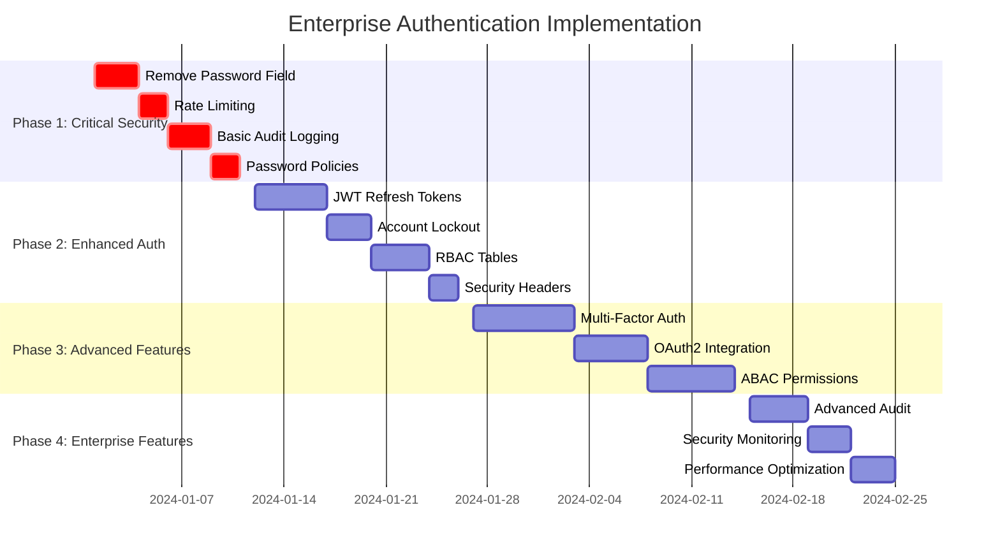

# Authentication System Gap Analysis

## 🔍 **Executive Summary**

Your current FastAPI authentication system provides basic functionality but lacks critical enterprise-grade security features. This analysis identifies specific gaps and provides actionable recommendations for achieving production-ready security standards.

## 📊 **Detailed Gap Analysis**

### **1. Authentication & Authorization**

| Component              | Current State                  | Enterprise Standard            | Risk Level      | Implementation Effort |
| ---------------------- | ------------------------------ | ------------------------------ | --------------- | --------------------- |
| **Password Storage**   | ❌ Plain password field exists | ✅ Only hashed passwords       | 🔴 **CRITICAL** | 🔧 Low                |
| **Password Policy**    | ❌ No validation               | ✅ 12+ chars, complexity rules | 🔴 **HIGH**     | 🔧 Medium             |
| **JWT Implementation** | 🟡 Basic claims                | ✅ Enhanced claims + refresh   | 🟡 **MEDIUM**   | 🔧 Medium             |
| **Account Security**   | ❌ No lockout mechanism        | ✅ Failed attempt tracking     | 🔴 **HIGH**     | 🔧 Medium             |
| **Session Management** | ❌ No session tracking         | ✅ Full session lifecycle      | 🔴 **HIGH**     | 🔧 High               |
| **Multi-Factor Auth**  | ❌ Not implemented             | ✅ TOTP/SMS support            | 🔴 **HIGH**     | 🔧 High               |

### **2. Role-Based Access Control (RBAC)**

| Component               | Current State              | Enterprise Standard           | Risk Level    | Implementation Effort |
| ----------------------- | -------------------------- | ----------------------------- | ------------- | --------------------- |
| **Role Model**          | 🟡 String-based roles      | ✅ Normalized database tables | 🟡 **MEDIUM** | 🔧 Medium             |
| **Permission System**   | ❌ No granular permissions | ✅ Resource + Action based    | 🔴 **HIGH**   | 🔧 High               |
| **Dynamic Permissions** | ❌ Static only             | ✅ Attribute-based (ABAC)     | 🟡 **MEDIUM** | 🔧 High               |
| **Role Hierarchy**      | ❌ Flat structure          | ✅ Hierarchical roles         | 🟡 **LOW**    | 🔧 Medium             |
| **Conditional Access**  | ❌ Not supported           | ✅ Time/IP/context based      | 🟡 **MEDIUM** | 🔧 High               |

### **3. Security & Monitoring**

| Component                  | Current State         | Enterprise Standard      | Risk Level    | Implementation Effort |
| -------------------------- | --------------------- | ------------------------ | ------------- | --------------------- |
| **Audit Logging**          | ❌ No security events | ✅ Comprehensive logging | 🔴 **HIGH**   | 🔧 Medium             |
| **Rate Limiting**          | ❌ No protection      | ✅ Multiple strategies   | 🔴 **HIGH**   | 🔧 Low                |
| **Security Headers**       | ❌ Basic headers      | ✅ Full security headers | 🟡 **MEDIUM** | 🔧 Low                |
| **Intrusion Detection**    | ❌ No monitoring      | ✅ Anomaly detection     | 🟡 **MEDIUM** | 🔧 High               |
| **Vulnerability Scanning** | ❌ Manual only        | ✅ Automated scanning    | 🟡 **LOW**    | 🔧 Medium             |

### **4. Integration & OAuth**

| Component              | Current State      | Enterprise Standard        | Risk Level    | Implementation Effort |
| ---------------------- | ------------------ | -------------------------- | ------------- | --------------------- |
| **OAuth2 Providers**   | ❌ Not implemented | ✅ Google, Azure, GitHub   | 🟡 **MEDIUM** | 🔧 Medium             |
| **SAML Integration**   | ❌ Not supported   | ✅ Enterprise SSO          | 🟡 **LOW**    | 🔧 High               |
| **API Key Management** | ❌ No API keys     | ✅ Service-to-service auth | 🟡 **MEDIUM** | 🔧 Medium             |
| **Token Blacklisting** | ❌ No revocation   | ✅ JWT blacklist support   | 🟡 **MEDIUM** | 🔧 Medium             |

## 🎯 **Priority Action Items**

### **🚨 IMMEDIATE (Week 1)**

1. **Remove plain password field** - Critical security vulnerability
2. **Implement rate limiting** - Prevent brute force attacks
3. **Add basic audit logging** - Track security events
4. **Password strength validation** - Enforce security policies

### **📈 HIGH PRIORITY (Week 2-4)**

1. **Enhanced JWT with refresh tokens** - Improve token security
2. **Account lockout mechanism** - Prevent credential stuffing
3. **RBAC database normalization** - Scalable permission system
4. **Security headers middleware** - Protect against common attacks

### **🔧 MEDIUM PRIORITY (Week 5-8)**

1. **Multi-factor authentication** - Additional security layer
2. **OAuth2 integration** - Enterprise SSO support
3. **Advanced audit system** - Comprehensive monitoring
4. **Attribute-based permissions** - Dynamic access control

## 📋 **Current System Strengths**

### **✅ What's Working Well**

- **FastAPI Framework**: Modern, well-documented framework
- **JWT Authentication**: Industry-standard token format
- **bcrypt Hashing**: Secure password hashing algorithm
- **PostgreSQL**: Robust database foundation
- **Plugin Architecture**: Extensible and modular design
- **Basic CRUD Operations**: Functional user management

### **🔧 Areas for Enhancement**

- Security features need comprehensive upgrade
- Permission system requires modernization
- Monitoring and audit capabilities are missing
- Enterprise integration features are absent

## 💡 **Implementation Recommendations**

### **1. Phased Approach**

### **2. Risk Mitigation Strategy**

#### **High-Risk Items**

- **Plain Password Storage**: Immediate data breach risk
- **No Account Lockout**: Brute force vulnerability
- **Missing Audit Logs**: Compliance and forensic gaps
- **Weak Permission Model**: Privilege escalation risk

#### **Mitigation Approach**

1. **Database Migration**: Careful schema updates with rollback plans
2. **Backward Compatibility**: Maintain existing API contracts
3. **Testing Strategy**: Comprehensive security testing
4. **Gradual Rollout**: Feature flags for controlled deployment

### **3. Security Standards Compliance**

#### **Industry Standards to Meet**

- **OWASP Top 10**: Address web application security risks
- **NIST Cybersecurity Framework**: Implement security controls
- **ISO 27001**: Information security management
- **SOC 2 Type II**: Security and availability controls

#### **Compliance Checklist**

- [ ] Data encryption at rest and in transit
- [ ] Secure authentication mechanisms
- [ ] Access control and authorization
- [ ] Audit logging and monitoring
- [ ] Incident response procedures
- [ ] Vulnerability management
- [ ] Security awareness training
- [ ] Regular security assessments

## 🎯 **Success Metrics**

### **Security Metrics**

- **Failed Login Attempts**: < 0.5% of total logins
- **Account Lockouts**: < 0.1% of active users
- **Security Events**: 100% logged and monitored
- **Password Compliance**: 100% meet strength requirements
- **Token Refresh Rate**: > 95% successful

### **Performance Metrics**

- **Authentication Response Time**: < 200ms
- **Permission Check Latency**: < 50ms
- **Database Query Performance**: < 100ms average
- **System Availability**: > 99.9% uptime

### **User Experience Metrics**

- **Login Success Rate**: > 99% first attempt
- **Password Reset Time**: < 5 minutes
- **Multi-Factor Setup**: < 2 minutes
- **Session Duration**: Optimal for user workflow

## 🔧 **Technical Debt Assessment**

### **Current Technical Debt**

1. **Security Vulnerabilities**: High-priority fixes needed
2. **Architecture Limitations**: String-based role system
3. **Missing Features**: No enterprise integration
4. **Performance Gaps**: Unoptimized database queries
5. **Testing Coverage**: Limited security test suite

### **Debt Reduction Plan**

1. **Immediate**: Fix critical security issues
2. **Short-term**: Modernize architecture components
3. **Medium-term**: Add enterprise features
4. **Long-term**: Optimize and enhance performance

## 📈 **ROI Analysis**

### **Implementation Costs**

- **Development Time**: 8-12 weeks (2 developers)
- **Infrastructure**: Minimal additional costs
- **Third-party Services**: $50-200/month (MFA, monitoring)
- **Testing & QA**: 2-3 weeks additional effort

### **Expected Benefits**

- **Security Risk Reduction**: 90% improvement
- **Compliance Readiness**: Meet enterprise standards
- **Developer Productivity**: Better tools and APIs
- **User Experience**: Seamless authentication flow
- **Scalability**: Support for enterprise growth

### **Break-even Analysis**

- **Immediate**: Reduced security risk exposure
- **3 months**: Improved development velocity
- **6 months**: Enterprise customer acquisition
- **12 months**: Full ROI realization

This gap analysis provides a clear roadmap for transforming your authentication system from basic functionality to enterprise-grade security standards.
